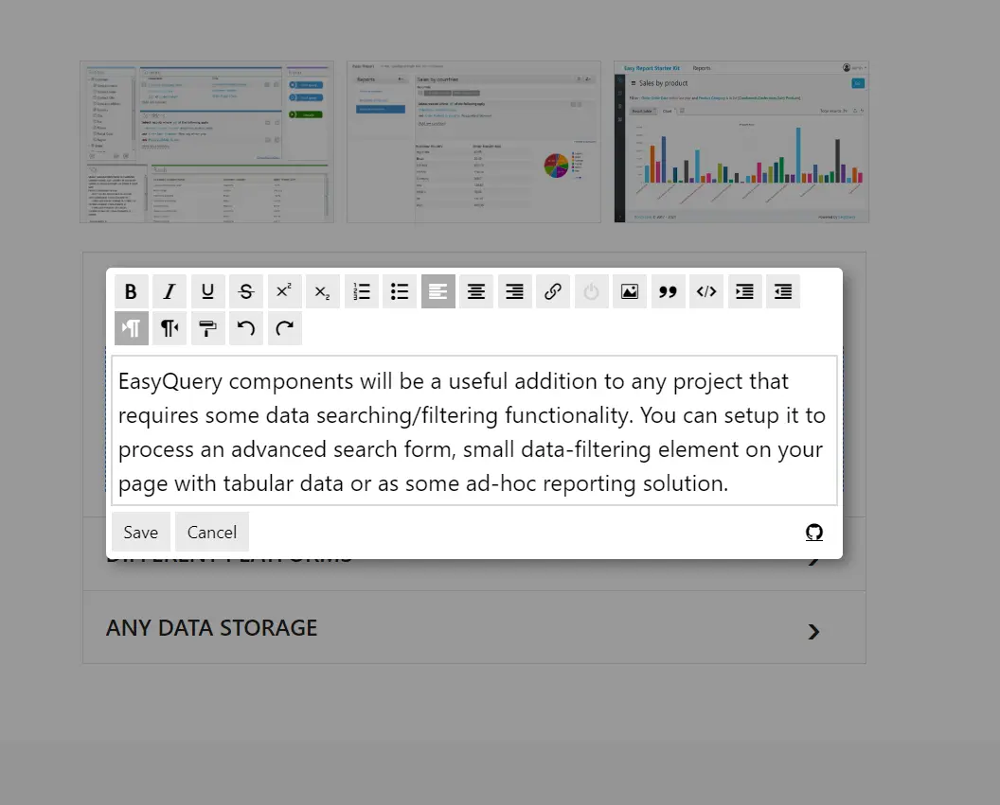

# ENEI Editor

Enei Editor - InPlace html editor for ENEI CMS.



## Install

```shell
npm i @olton/enei-editor
```

## Using
```javascript
import {createEneiEditor} from "@olton/enei-editor"

createEneiEditor({
    shortcut: "alt+ctrl+e",
    serverEndpoint: "http://localhost:5232",
    maxHeight: 300
})
```

or use a precompiled version directly in browser
```html
<script src="https://cdn.jsdelivr.net/gh/olton/enei-editor/lib/enei-editor.js"></script>
<script>
    EneiEditor.createEneiEditor({
        shortcut: "alt+ctrl+e",
        serverEndpoint: "http://localhost:5232",
        maxHeight: 300
    })
</script>
```

Copyright 2023 by [Serhii Pimenov](https://pimenov.com.ua). Licensed Under MIT license.